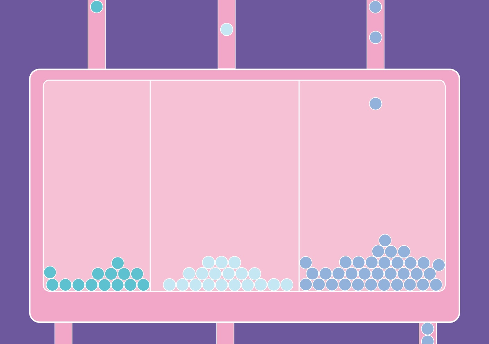

# Projet: JS Clocks (GR461)

Lucie Ecuyer

Un projet de design web dont l'objectif est de concevoir une interface permettant de visualiser l'écoulement du temps.

Description du projet :

Dans cette interface, il y a trois boîtes. De gauche à droite, la première correspond au nombre d'heures,la deuxième de minutes et la dernière en seconde. Dans chacune de ces boîtes tombe une bille, en fonction de l'heure, minute & seconde.

Exemple : 16h15 et 10 secondes = 16 billes dans la première boîte, 15 billes dans la deuxième et 10 billes dans la troisième.

A la fin de chaque heure, toutes les billes de chaque boîte tombent toutes en même temps dans un réservoir (non visible) qui se trouve en dessous des trois boitiers. Ce qui fait par la suite place aux nouvelles billes de la nouvelle heure qui arrive.

Etapes du projet :

1. Fabriquer les trois boîtes

2. Fabriquer les billes

3. Faire en sorte que les billes bougent

4. Synchroniser le mouvement des billes en fonction de l'heure indiquée

Détail du brief: https://3.basecamp.com/3165988/buckets/4702925/vaults/650815541

## Contenu de ce dossier

- index.html = un fichier HTML basique

Ce fichier charge les éléments suivants:

- css/normalize.css = un "normalisateur", voir http://necolas.github.io/normalize.css/
- css/style.css = une feuille de style CSS que vous pourrez modifier.
- font = dossier contenant la webfont NotCourierSans, à titre d'exemple.
- js/clocks.js = un endroit où mettre votre code JavaScript.

## Fonctionnement

((à définir))

Automne 2017  
Eracom, Lausanne
